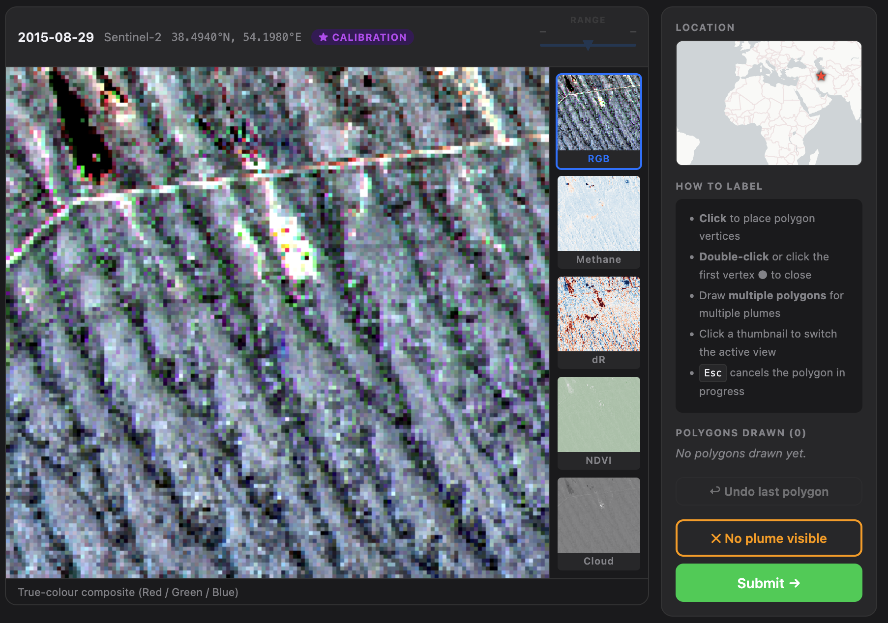

# MethaneBench Plume Labeler

A web-based tool for crowd-sourced annotation of methane plumes in multispectral satellite imagery. Part of the [FETCH₄ project](https://fetch4.github.io).  Live version is hosted here: [https://bench4.atmos.uw.edu](https://bench4.atmos.uw.edu).




## Overview

Users are presented with satellite scenes one at a time and asked to draw polygons around any visible methane plumes, or indicate that no plume is present. Labels are stored in a local SQLite database and can be exported as JSON.

**Spectral views available per scene:**
- **RGB** — true-colour composite (percentile-stretched)
- **DR** — differential ratio (SWIR1 − SWIR2) / (SWIR1 + SWIR2), sensitive to CH₄ absorption
- **Z-score** — DR anomaly relative to same-year background acquisitions
- **NDVI** — vegetation index for context
- **Cloud** — brightness-based cloud mask

**Calibration scenes** (defined in `calibration_scenes.txt`) are shown to every user first, in priority order, before random scenes are served. This ensures inter-annotator agreement can be assessed on a common set.

## Requirements

- Python ≥ 3.11
- [pixi](https://pixi.sh) (recommended) **or** pip

Dependencies: `fastapi`, `uvicorn`, `netCDF4`, `numpy`, `Pillow`, `matplotlib`, `pydantic`

## Installation

**With pixi:**
```bash
pixi install
```

**With pip:**
```bash
pip install -r requirements.txt
```

## Running

**Local development** (imagery served from `./imagery`):
```bash
pixi run dev
# or
IMAGERY_PATH=./imagery uvicorn app:app --host 127.0.0.1 --port 8000
```

**Production:**
```bash
IMAGERY_PATH=/path/to/imagery uvicorn app:app --host 0.0.0.0 --port 8000
```

Then open `http://localhost:8000` in a browser.

## Configuration

All configuration is via environment variables:

| Variable | Default | Description |
|---|---|---|
| `IMAGERY_PATH` | `./imagery` | Path to the imagery folder |
| `DB_PATH` | `./labels.db` | Path to the SQLite labels database |
| `CALIBRATION_FILE` | `./calibration_scenes.txt` | Path to calibration scene list |

## Imagery format

Imagery is stored as NetCDF4 files under `IMAGERY_PATH`, organized by instrument:

```
imagery/
  sentinel2/       # Sentinel-2 scenes
  landsat_89/      # Landsat 8/9 scenes
  landsat_45/      # Landsat 4/5 scenes
```

Each `.nc` file contains all acquisitions for one geographic location. Expected variables:

| Variable | Shape | Description |
|---|---|---|
| `channels` | `(n_acq, H, W, 6)` | Blue, Green, Red, NIR, SWIR1, SWIR2 |
| `year` | `(n_acq,)` | Acquisition year |
| `month` | `(n_acq,)` | Acquisition month |
| `day` | `(n_acq,)` | Acquisition day |
| `clat` | scalar | Center latitude |
| `clon` | scalar | Center longitude |
| `resolution` | scalar | Pixel resolution (m) |

## Calibration scenes

`calibration_scenes.txt` lists scenes shown to every user before random scenes are served. Format:

```
# instrument  clat     clon    acq_idx  # date (comment)
sentinel2      38.4940  54.1980  0       # 2015-08-29
landsat_89     38.4940  54.1980  5       # 2019-06-12
```

Lines starting with `#` are ignored. If the file is not found, the first 10 shuffled scenes are used as a fallback.

## API endpoints

| Method | Path | Description |
|---|---|---|
| `POST` | `/api/user/login` | Register or retrieve a user |
| `GET` | `/api/scene/next?user_id=` | Get the next unlabeled scene |
| `POST` | `/api/label` | Submit a label |
| `GET` | `/api/render?scene_id=&view=&vmin=&vmax=` | Re-render a view with custom colormap range |
| `GET` | `/api/stats` | Total labels, users, and scenes |
| `GET` | `/api/export/labels` | Export all labels and users as JSON |

## Exporting labels

Navigate to `/api/export/labels` (or click the link in the footer) to download a JSON file containing all submitted labels and user metadata.

## Deployment behind Apache

The app serves its own frontend at `/` — no separate redirect file is needed. Proxy all requests to uvicorn in your VirtualHost:

```apacheconf
ProxyPass        /  http://127.0.0.1:8000/
ProxyPassReverse /  http://127.0.0.1:8000/
```

If the app is mounted at a subpath (e.g. `/labeler/`), set FastAPI's `root_path`:

```bash
uvicorn app:app --root-path /labeler --host 0.0.0.0 --port 8000
```

## Database

`labels.db` is created automatically on first startup — no setup required. It is excluded from version control (`.gitignore`) since it contains user data. Back it up separately in production.

## Contact

[Alex Turner](https://alexjturner.github.io/) — University of Washington

## License

See [LICENSE](LICENSE).
